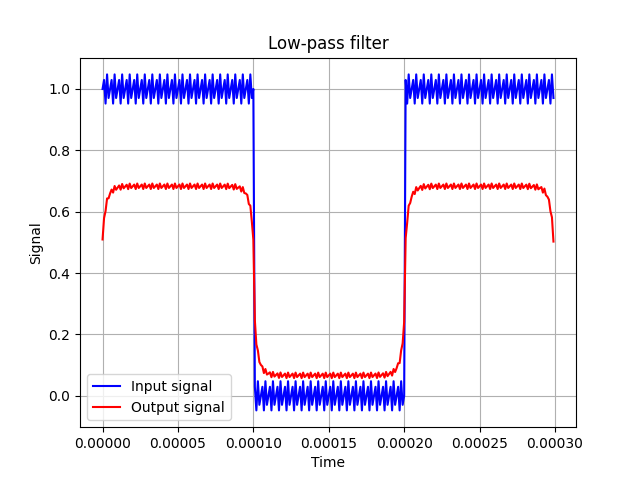
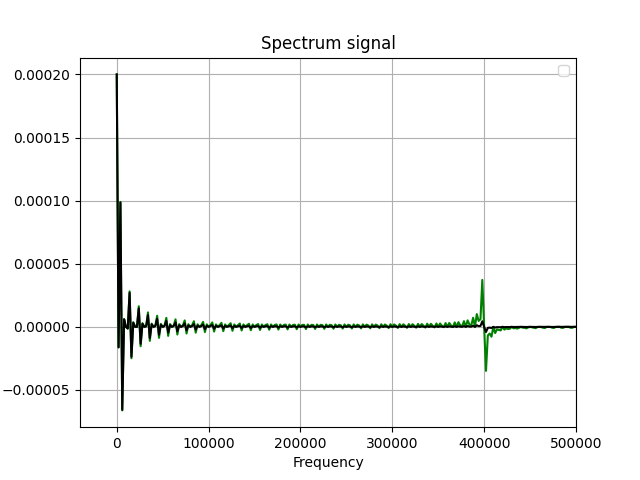

# Low-pass filter realisation

Program demonstrates work of the low-pass filter. With the help of Fourier transformation and addition of each frequency to the transmission coefficient we cancel the signal. After that we get the desired signal (meander) by inverse Fourier transformation.
In our program for example we use signal `x(t) = Xm + A * sin(8pi * t / T)`, where Xm is meander

# Build

You have to install libraries `numpy` and `matplotlib`:
```
pip install numpy matplotlib
```

And then run the script:
```
python3 low-filter.py
```

# Results

Graph of the signal



There is we can see that on frequency about 400kHz signal canceles

